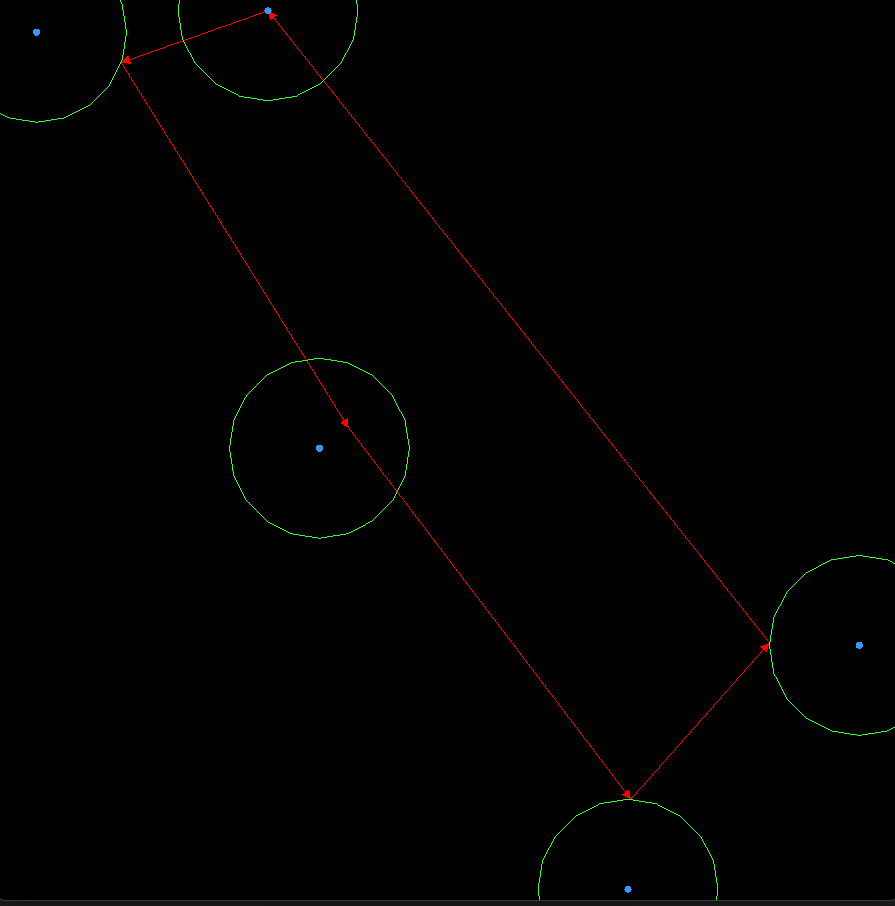
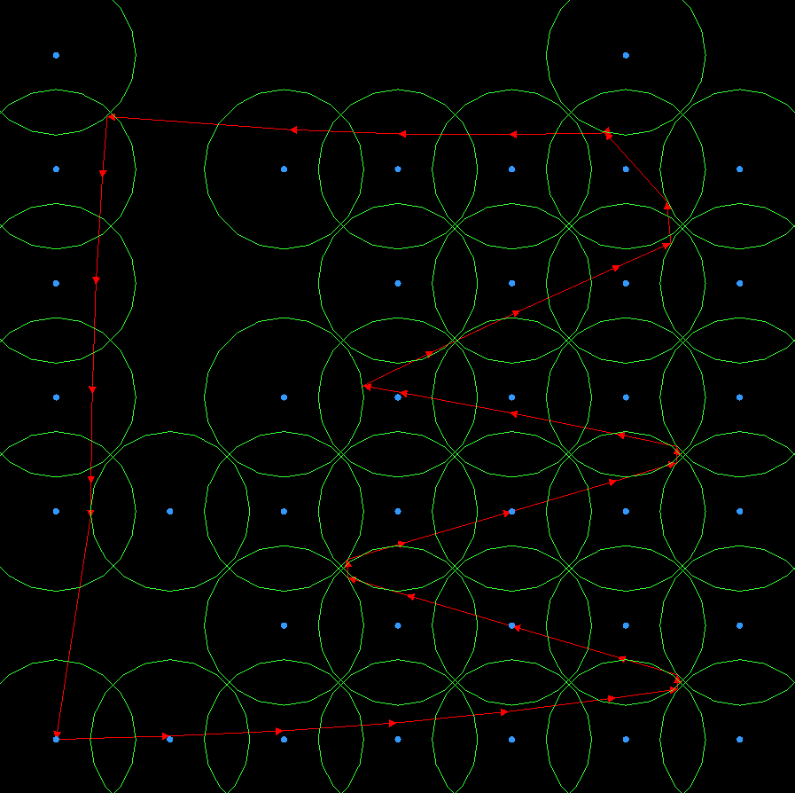
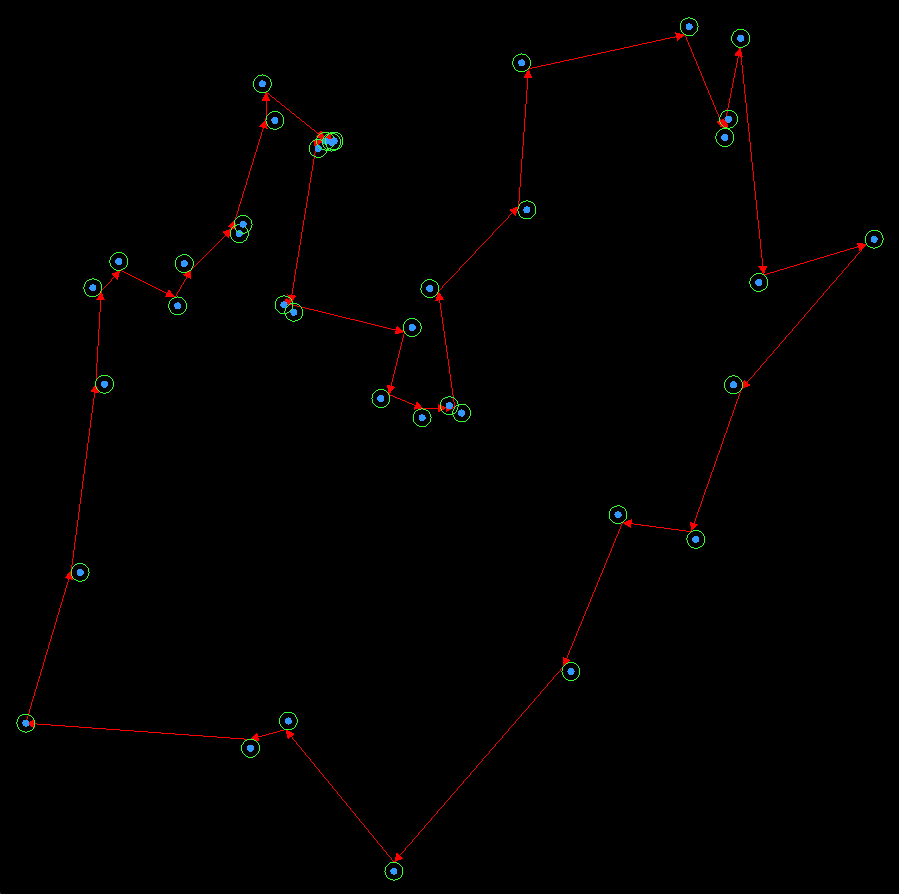
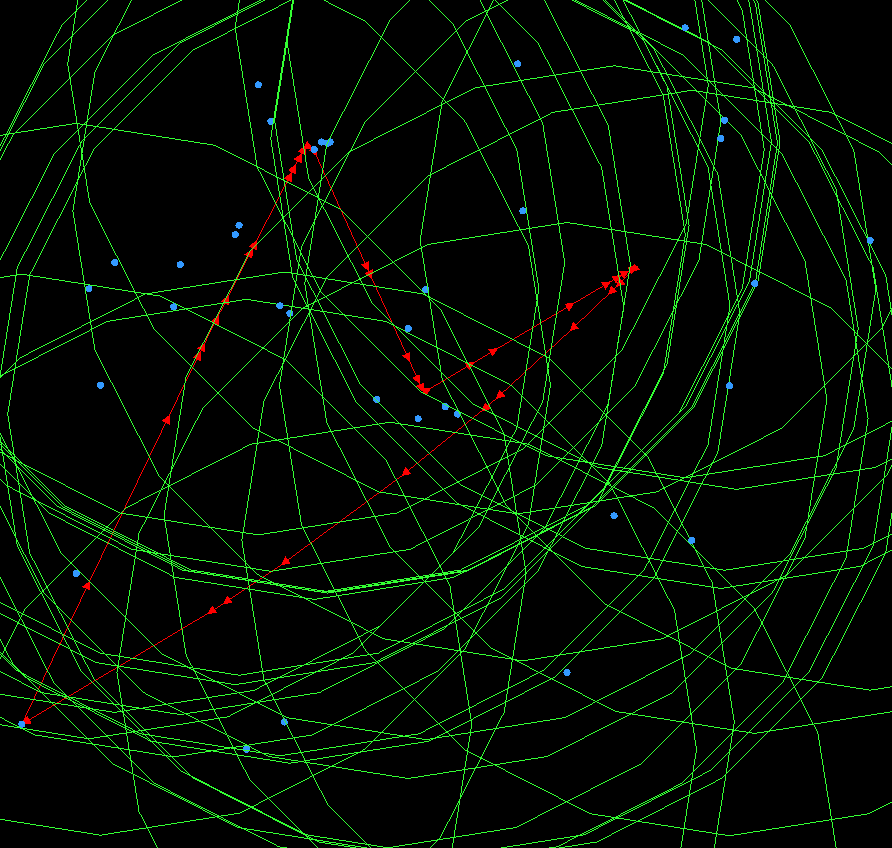

# How to Build and Run CudaOpenGLFlocking

Open PowerShell in the project root (C:\Users\{user}\CLionProjects\CudaOpenGLFlocking). If you want a clean build, delete the build folder by running:

```powershell
rm -r -fo build
```

Then configure the project with CMake by running:

```powershell
cmake -B build -S .
```
 
Then build it:

```powershell
cmake --build build
```

If the build finishes successfully, the executable will be located at:

```
build\Debug\CudaOpenGLFlocking.exe
```

To run it:

```powershell
.\build\Debug\CudaOpenGLFlocking.exe
```

If you get an error saying that `glew32d.dll` is missing, copy it manually from:

```
build\bin\Debug\glew32d.dll
```

into:

```
build\Debug\
```

If you ever see a fatal error about missing `glfw3.lib` or `glew_static.lib`, it means you did not add the subdirectories correctly in your CMakeLists.txt. Make sure you have:

```cmake
add_subdirectory(libs/glew/build/cmake)
add_subdirectory(libs/glfw)
```

Also make sure you are linking to the correct targets:

```cmake
target_link_libraries(${PROJECT_NAME} glew_s glfw opengl32)
```

If you need to completely rebuild and run quickly, the full set of commands is:

```powershell
rm -r -fo build
cmake -B build -S .
cmake --build build
.\build\Debug\CudaOpenGLFlocking.exe
```

GLEW, GLFW, and OpenGL are all linked automatically now. CUDA separable compilation is enabled for your CUDA sources. Debug builds use dynamic runtime (/MDd). Ignore linker warnings like LIBCMT conflicts during Debug builds. End of instructions.


## **What is the Data Mule Routing Problem (DMRP)?**

The **Data Mule Routing Problem (DMRP)** is a variant of the classical **Traveling Salesman Problem (TSP)** where one or more agents, known as **data mules**, must visit a set of static sensor nodes to collect data. Unlike traditional TSP where the objective is simply to find the shortest tour visiting all cities, DMRP is characterized by:

- **Geometric constraints**: Each sensor node has a limited communication radius (ex. a WiFi signal radius). A data mule only needs to enter this radius to collect the sensor information, not visit the exact node.
- **Distance optimazation**: The path that the mule/mules take should be as short as possible. In scenarios like smart forest rescue operations, the time that is wasted by inefficient routes can directly harm the chances of finding a missing person. 
- **Generation Time**: Additionally, the time of generating the pathing of the mules must be considered. For example, if the algorithm took 4 hours to run on a dataset of size 100, then the search for the missing person would be delayed by this long. For this reason, we must strike a balance between finding the absolute best solution and finding a close to optimal solution in a far shorter amount of time.

This makes DMRP more realistic for wireless sensor networks, but also significantly more complex than standard TSP.

---

## **This Project: GPU-Accelerated Hybrid Optimization**

To solve DMRP efficiently, this project implements a **hybrid two-stage optimization strategy**:

### 1. **Ant Colony Optimization (ACO) on CUDA**
The first stage uses a parallelized **Ant Colony Optimization** algorithm, offloaded to the GPU using CUDA. ACO is a population-based metaheuristic inspired by the foraging behavior of ants, where:
- Logical "ants" probabilistically build paths based on pheromone trails and distance heuristics.
- Pheromone levels are updated iteratively to select shorter paths over time.
- CUDA is used to parallelize the simulation of ants and pheromone updates to speed up generation time. In real-world scenarios where drones need to be launched quickly, like in search-and-rescue, this can directly improve success rates.

This first step allows for a good initial solution that solidifies which order we will visit the sensors, however, it does not yet
respect the radius of communication that each sensor has. As such, each route takes us from the exact sensor position to the next sensors position.
In the next step, we optimize the exact position inside the sensor radius that the drone would take. For example: flying to the edge of the radius, instead
of adding distance and flying to the exact sensor location.

### 2. **Gradient Descent Path Optimization**
The second stage applies a **gradient-based local optimization** technique to refine the ACO-generated route:
- Each point along the path is adjusted to lie within the communication radius of its assigned sensor node.
- The objective is to **minimize the total path length** while keeping each visit within the allowed sensor bounds.
- A constrained gradient descent method nudges each waypoint within a circle until no significant improvement is possible.

This two-step hybrid approach allowed for massive speedups in the initial global path generation, while still optimizing 
with respect to the sensor radii. Essentially, if we instead used grid samples withiin the radii and performed the ACO on that, the time complexity
would have exploded to intractable levels even for small datasets. 

---

## **Visualization**
The final route is rendered using **OpenGL**, displaying:

| Visual Element                 | Representation     |
|-------------------------------|---------------------|
| Sensor positions              |  Blue dots        |
| Route taken by the data mule |  Red arrows       |
| Sensor communication radii   |  Green circles    |
---


## Small Sample Example

The following image is a basic example of what the problem aims to solve. Instead of visiting each sensor directly, we compute a route that intersects the edge of each sensor's communication radius. In this example, the uppermost node, where the arrow enters and exits the blue dot, is the base station.



---

## Grid Example

This image shows a grid layout with some cities randomly removed. The base station is located in the lower-left corner.



---

## Djibouti (38 Cities) — Small Radius

Here, each sensor has a small, non-overlapping communication radius. The DMRP in this case essentially becomes a standard Traveling Salesman Problem, as the mule must get close to every node. The base station is the lower-left most node.



---

## Djibouti (38 Cities) — Large Radius

This image highlights the importance of the second step of gradient descent optimization. Without adjusting the path within each sensor’s radius, the mule would follow the same path as in the small-radius case. With larger, overlapping radii, the mule can collect data from many sensors simultaneously, resulting in a significantly shorter path (as shown by the red arrows).




